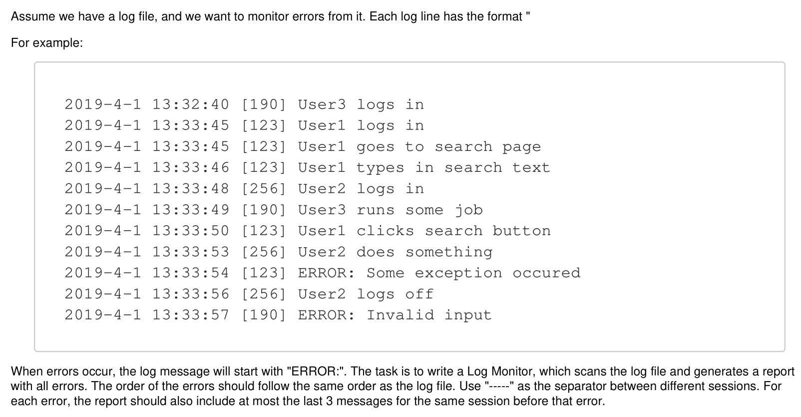

# Python Script to Monitor Log File for Errors

## Scenario


## Prerequisite
Python version 3.8 is installed on your local machine

## How to run the script
Type the following command on your terminal
```
python3 main.py
```
